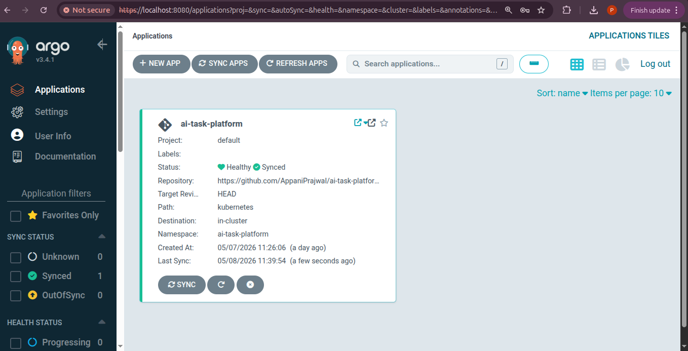
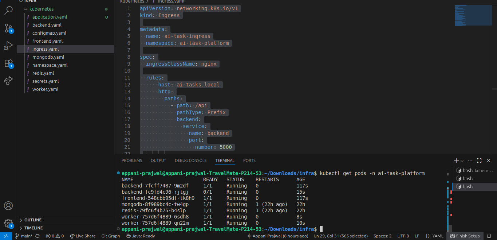

# ai-task-platform-infra

Kubernetes infrastructure manifests for the AI Task Processing Platform.

This repository acts as the **GitOps source of truth** for the platform. Argo CD continuously watches this repository and automatically synchronizes changes into the Kubernetes cluster.

---

## GitOps Deployment Flow

```text
Developer Push
      │
      ▼
GitHub Actions (Application Repo)
      │
      ├── Build Docker Images
      ├── Push Images to Docker Hub
      └── Update Image Tags in Infra Repo
                      │
                      ▼
        ai-task-platform-infra
                      │
                      ▼
                 Argo CD
                      │
                      ▼
             Kubernetes Cluster
```

---

## Infrastructure Architecture

```text
┌─────────────────────────────────────────────┐
│             Kubernetes Cluster             │
│                                             │
│  ┌──────────────┐                           │
│  │   Ingress    │                           │
│  └──────┬───────┘                           │
│         │                                   │
│   ┌─────▼─────┐                             │
│   │ Frontend  │                             │
│   └─────┬─────┘                             │
│         │                                   │
│   ┌─────▼─────┐                             │
│   │ Backend   │                             │
│   └─────┬─────┘                             │
│         │                                   │
│   ┌─────▼─────┐                             │
│   │   Redis   │                             │
│   └─────┬─────┘                             │
│         │                                   │
│   ┌─────▼─────┐                             │
│   │  Workers  │                             │
│   └─────┬─────┘                             │
│         │                                   │
│   ┌─────▼─────┐                             │
│   │ MongoDB   │                             │
│   └───────────┘                             │
└─────────────────────────────────────────────┘
```

---

# Repository Structure

```text
infra/
└── kubernetes/
    ├── application.yaml
    ├── namespace.yaml
    ├── secrets.yaml
    ├── configmap.yaml
    ├── backend.yaml
    ├── worker.yaml
    ├── frontend.yaml
    ├── redis.yaml
    ├── mongodb.yaml
    └── ingress.yaml
```

---

# Kubernetes Resources

| File | Purpose |
|---|---|
| `application.yaml` | Argo CD Application definition |
| `namespace.yaml` | Creates isolated namespace |
| `secrets.yaml` | Secret placeholders for MongoDB URI and JWT |
| `configmap.yaml` | Shared non-secret configuration |
| `backend.yaml` | Backend Deployment + Service |
| `worker.yaml` | Python worker Deployment |
| `frontend.yaml` | Frontend Deployment + Service |
| `redis.yaml` | Redis Deployment + Service |
| `mongodb.yaml` | Optional MongoDB Deployment + Service |
| `ingress.yaml` | Nginx ingress routing |

---

# Features

- Kubernetes-based microservices deployment
- GitOps continuous delivery using Argo CD
- Automated rolling deployments
- SHA-tagged immutable Docker images
- Ingress-based routing
- Resource requests and limits
- Kubernetes liveness/readiness probes
- Secret-based configuration management
- Redis-backed asynchronous processing architecture

---

# Initial Cluster Setup

## Prerequisites

Install:
- Docker
- kubectl
- Minikube
- Argo CD

---

## 1. Start Minikube

```bash
minikube start
```

---

## 2. Enable Ingress

```bash
minikube addons enable ingress
```

---

## 3. Start Minikube Tunnel

```bash
minikube tunnel
```

---

## 4. Create Namespace

```bash
kubectl apply -f kubernetes/namespace.yaml
```

---

## 5. Create Kubernetes Secrets

```bash
kubectl create secret generic app-secrets \
  --from-literal=jwt-secret="your_jwt_secret" \
  --from-literal=mongo-uri="your_mongodb_uri" \
  -n ai-task-platform
```

> Never commit real secrets into Git repositories.

---

## 6. Apply Kubernetes Manifests

```bash
kubectl apply -f kubernetes/
```

---

## 7. Install Argo CD

```bash
kubectl create namespace argocd
```

```bash
kubectl apply -n argocd -f https://raw.githubusercontent.com/argoproj/argo-cd/stable/manifests/install.yaml
```

---

## 8. Access Argo CD

Start port forwarding:

```bash
kubectl port-forward svc/argocd-server -n argocd 8080:443
```

Get admin password:

```bash
kubectl get secret argocd-initial-admin-secret -n argocd -o jsonpath="{.data.password}" | base64 -d
```

Username:

```text
admin
```

---

## 9. Register Argo CD Application

```bash
kubectl apply -f kubernetes/application.yaml
```

---

# Verify Deployment

## Check Pods

```bash
kubectl get pods -n ai-task-platform
```

---

## Verify Argo CD Sync

```bash
kubectl get applications -n argocd
```

Expected:
- Healthy
- Synced

---

# CI/CD Workflow

1. Developer pushes code to `main`
2. GitHub Actions builds Docker images
3. Images pushed to Docker Hub
4. Infra manifests updated with new SHA image tags
5. Changes committed into infra repo
6. Argo CD detects drift
7. Kubernetes rolling deployment triggered automatically

---

# Resource Limits

| Service | CPU Request | CPU Limit | Memory Request | Memory Limit |
|---|---|---|---|---|
| Frontend | 50m | 100m | 64Mi | 128Mi |
| Backend | 100m | 250m | 128Mi | 256Mi |
| Worker | 100m | 500m | 128Mi | 256Mi |
| Redis | 100m | 250m | 128Mi | 256Mi |
| MongoDB | 250m | 500m | 256Mi | 512Mi |

---

# Screenshots

## Argo CD Dashboard



---

## Kubernetes Pods Running



---

# Future Improvements

- KEDA autoscaling
- Persistent volumes for Redis and MongoDB
- Prometheus + Grafana monitoring
- Distributed tracing
- Horizontal autoscaling
- Multi-environment overlays using Kustomize

---

# Related Repository

Application repository:
- AI-Task-Processing

